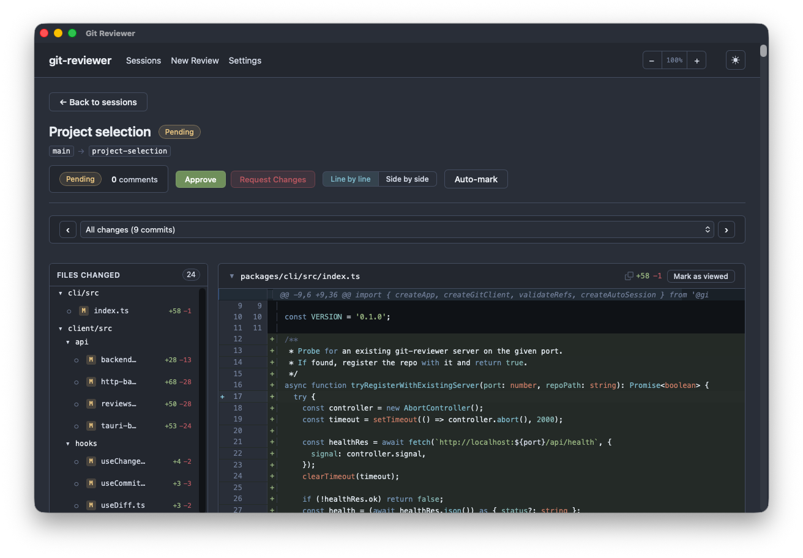
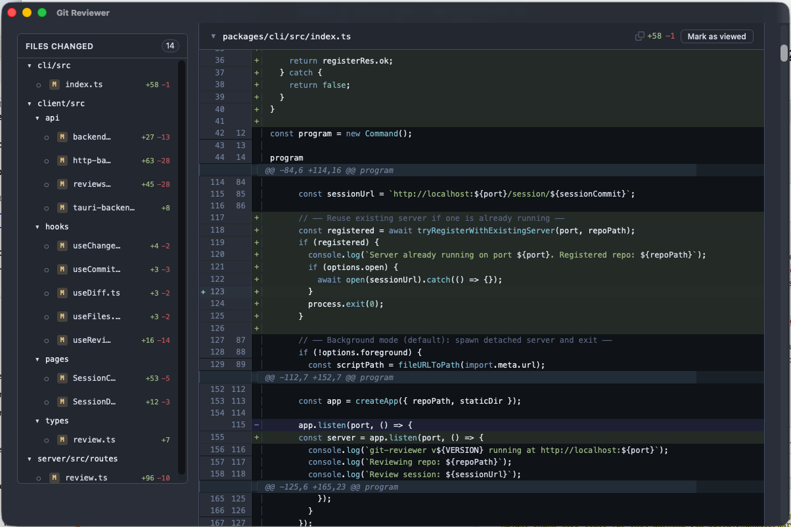
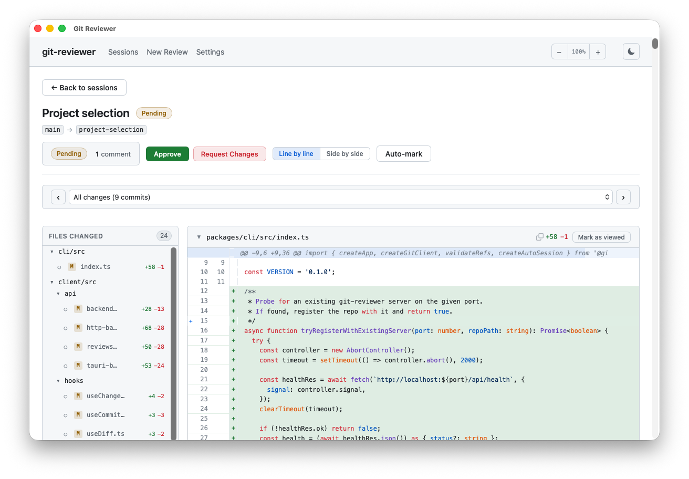
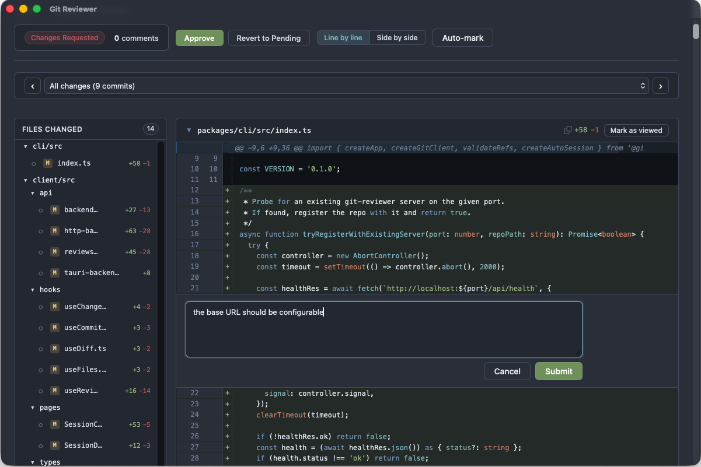
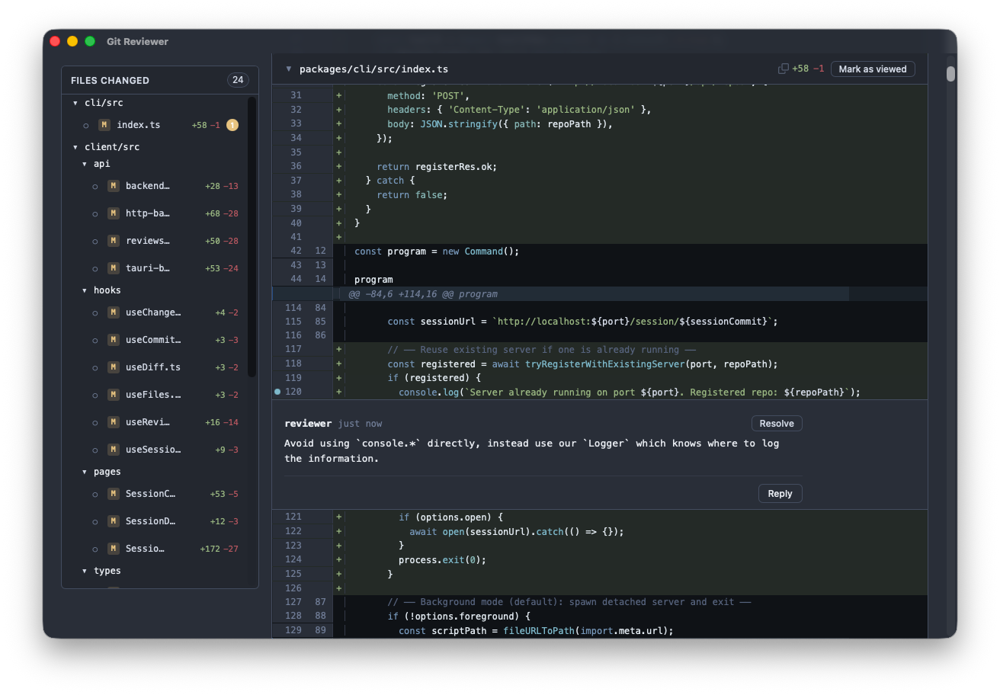
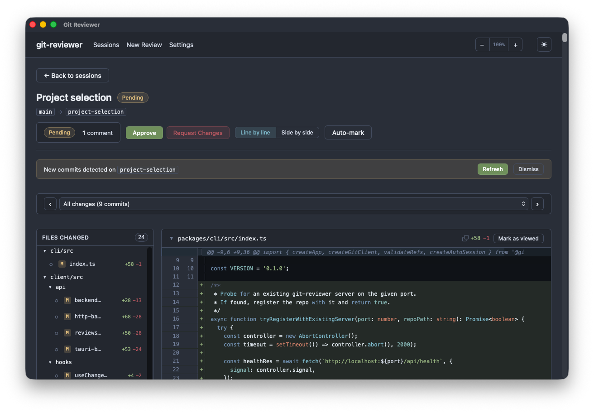

# Git Reviewer

A local code review tool that provides a GitHub PR-like experience for reviewing changes **before pushing to remote**.



## Why?

With the rise of AI-assisted coding (Claude Code, Copilot, Cursor, etc.), developers increasingly need to review large amounts of generated code before pushing it. The current options are:

- **GitHub/GitLab PRs** — require pushing to remote first, defeating the purpose
- **`git diff` in terminal** — no inline commenting, no review workflow
- **IDE diff viewers** — decent for viewing, but no commenting or review state

**Git Reviewer** fills this gap: a lightweight local app that reads your git repo directly, renders diffs with a familiar UI, and stores review comments in **git-notes** — keeping everything inside git itself.

## Features

### Diff viewer with syntax highlighting

Browse changes file-by-file with a familiar split-pane layout: file tree on the left, syntax-highlighted diff on the right. Supports both inline and side-by-side views.

| Dark theme                                                    | Light theme                                                    |
| ------------------------------------------------------------- | -------------------------------------------------------------- |
|  |  |

### Inline commenting

Click any diff line to leave a comment. Comments are persisted to git-notes, so they survive restarts and live inside your git repo — no external database needed.

| Adding a comment                                          | Comment displayed inline                                |
| --------------------------------------------------------- | ------------------------------------------------------- |
|  |  |

### Review sessions

Create named review sessions (like PRs) to track a set of changes. Approve, request changes, or leave them pending. Sessions are stored as git-notes attached to the head commit.



### And more

- Keyboard shortcuts (`n`/`p` for next/prev file, `c` for comment)
- File tree with changed file indicators
- Side-by-side diff view toggle
- New commits detection with refresh prompt
- Dark and light themes

## How it works

All review data (comments, review status, session metadata) is stored in [git-notes](https://git-scm.com/docs/git-notes) under `refs/notes/git-reviewer`. This means:

- No external database — everything lives in git
- Data survives repo clones if notes refs are fetched
- Comments are tied to specific commits
- Standard git tools can inspect the data (`git notes --ref=git-reviewer list`)

## Getting Started

### Prerequisites

- Node.js >= 20
- pnpm >= 9
- Git

### Install & Run

```bash
pnpm install
pnpm build

# Review current branch against main
git-reviewer serve --base main

# Review specific commit range
git-reviewer serve --base abc123 --head def456

# Review uncommitted changes
git-reviewer serve --uncommitted

# Specify a different repo path
git-reviewer serve --repo /path/to/repo --base main
```

### Desktop App (Tauri)

A native desktop app is also available, built with [Tauri](https://tauri.app/).

Pre-built binaries are available on the [Releases](https://github.com/mloureiro/git-reviewer-app/releases) page.

> **macOS users:** The app is not code-signed (this is a personal project, Apple charges $99/year for a signing certificate). macOS Gatekeeper will block it by default. After installing, run:
>
> ```bash
> xattr -cr "/Applications/Git Reviewer.app"
> ```
>
> Then open the app normally.

To build from source:

```bash
pnpm desktop:build
```

## Development

```bash
# Start server + client in dev mode
pnpm dev

# Run tests
pnpm test

# Typecheck
pnpm typecheck

# Lint
pnpm lint
```

### Project structure

This is a pnpm monorepo:

| Package            | Description                                        |
| ------------------ | -------------------------------------------------- |
| `packages/shared`  | Shared TypeScript types and utilities              |
| `packages/server`  | Express API — reads git repo, manages review data  |
| `packages/client`  | React + Vite frontend — diff rendering, comment UI |
| `packages/cli`     | CLI entry point (`git-reviewer serve`)             |
| `packages/desktop` | Tauri desktop app wrapping the web UI              |

## License

MIT
